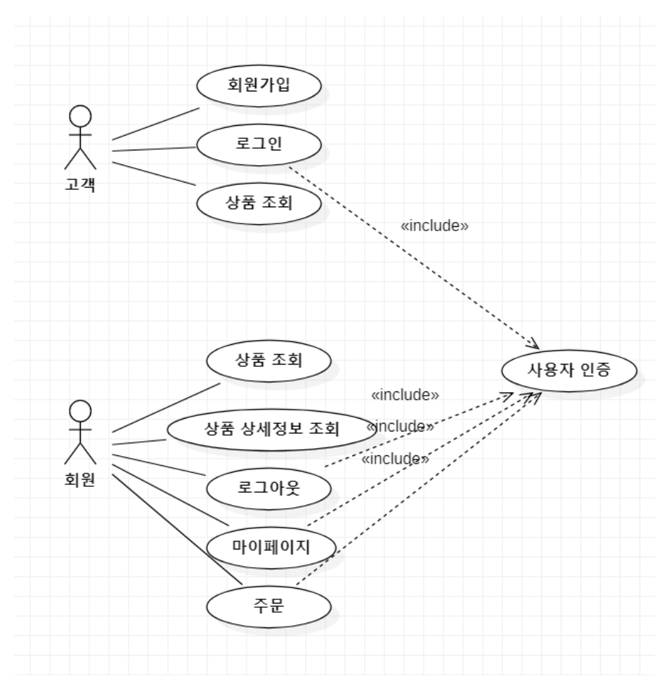
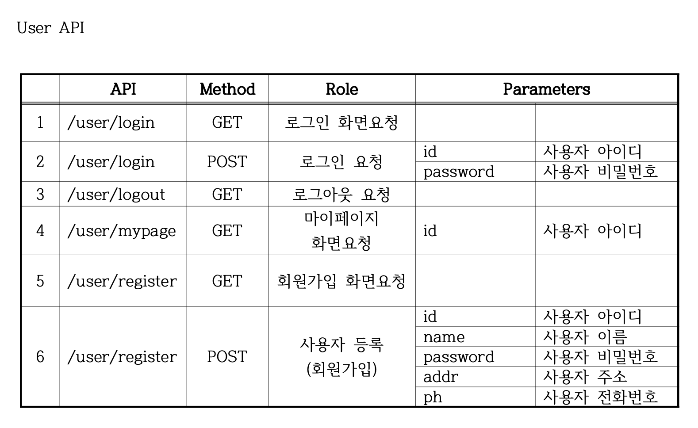
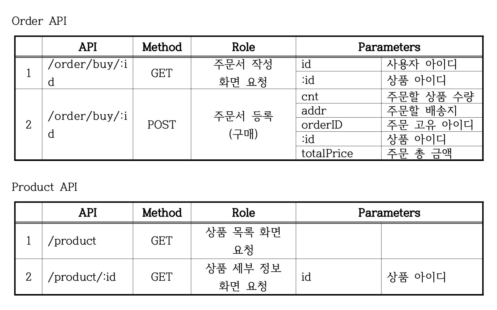
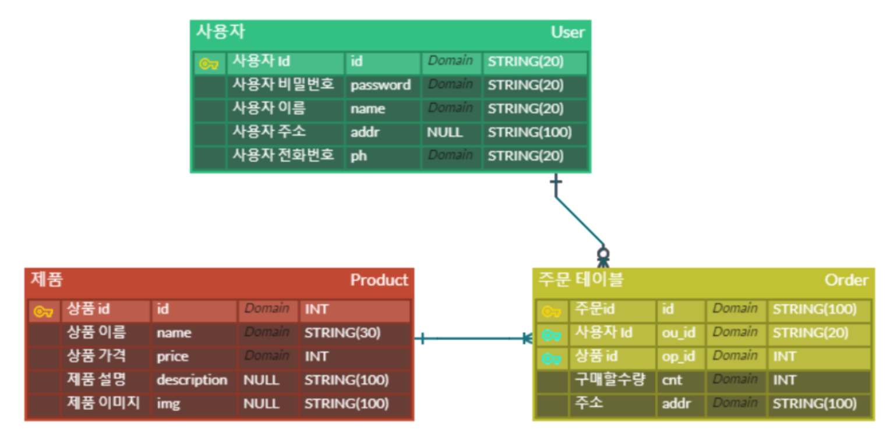

## 목차
1. 웹사이트 소개
2. 개발 환경
3. 주요 기능
4. 기본 구조
5. 모듈 구조
6. API 명세서
7. 데이터베이스 구조

---

</br></br>

# 🛍️ 쇼핑몰 웹사이트
코로나로 인해 배달 및 온라인 주문이 많아진 요즘 쇼핑몰 사이트의 작동 원리에 대해 알아보고자 상품을 구경하고 주문할 수 있는 쇼핑몰 사이트를 만들었다. 

</br></br>

## 개발 환경
- Backend : JavaScript, Node.js, Express
- Frontend :  HTML
- Database : MySQL, Sequelize
- IDE :  VSCode

</br></br>

## 주요 기능
- 로그인 /  회원가입
- 상품 목록 / 상품 상세 페이지
- 주문하기
- 주문 내역 확인하기
- 마이페이지

</br></br>

## 기본 구조
 

</br></br>

## 모듈 구조
```
project/
│
├── models/            
│   ├── index.js         
│   ├── order.js        
│   ├── product.js      
│   └── user.js          
├── passport/         
│   ├── index.js       
│   └── local.js        
├── routes/
│   ├── user.js
│   ├── order.js
│   ├── product.js
│   └── middlewares.js
├── uploads/
│   ├── img.png
│    ...
│
├── views/
│   ├── login.html
│    ...
│
├── app.js
└── .env

```

</br></br>

## API 명세서
 
 

</br></br>

## 데이터베이스 구조



